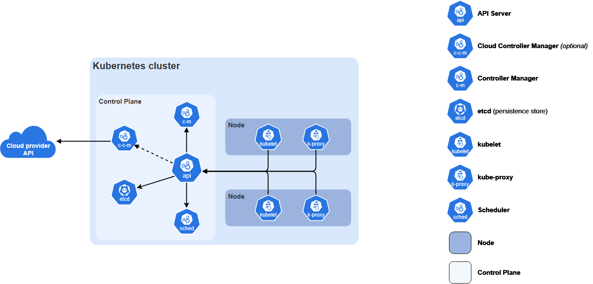
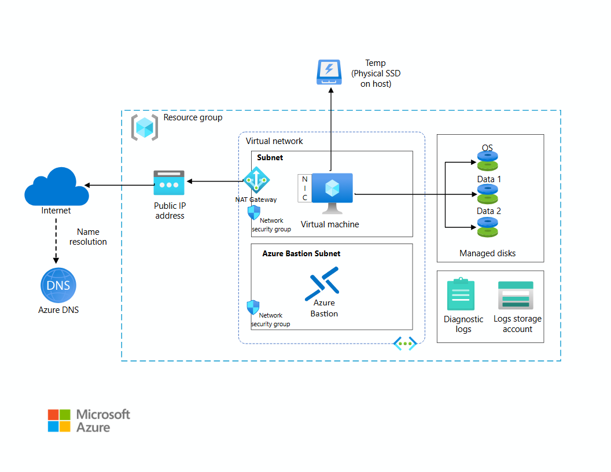
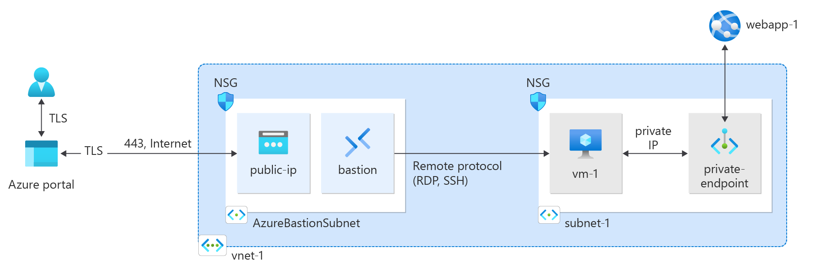
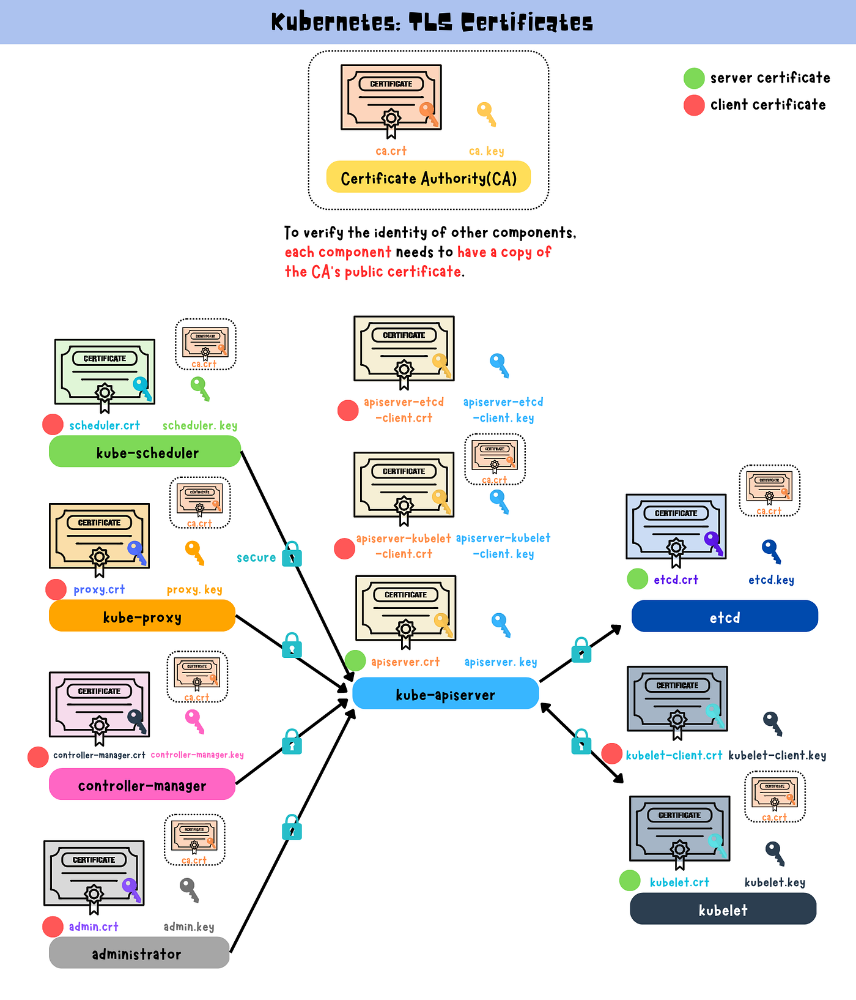

# 手搓K8s

## 01 Prerequisites 实操总结（Azure）

搭建一个完全不依赖托管 Kubernetes的基础设施环境，用于后续手动部署 Kubernetes 控制面和工作节点。

- 一个 Azure VNet（10.240.0.0/16）
- 一个 Subnet（10.240.0.0/24）
- 多台 Ubuntu VM：
    - cp-1, cp-2
    - worker-1, worker-2
- 本地 通过 Public IP + SSH\
- VM 之间通过 Private IP（10.240.0.x）



### 环境选择

- 云平台：Azure
- 操作系统：Ubuntu Server 22.04 LTS



### 网络规划
Virtual Network

名称：kth-vnet

- Address Space：10.240.0.0/16

- Subnet

名称：kth-subnet

- CIDR：10.240.0.0/24

创建 VNet & Subnet
```bash
az network vnet create \
  --resource-group xxx \
  --name kth-vnet \
  --address-prefix 10.240.0.0/16 \
  --subnet-name kth-subnet \
  --subnet-prefix 10.240.0.0/24
```



### 虚拟机规划
最小可用集群规模（学习用）
角色	名称	数量
Control Plane	cp-1, cp-2	2
Worker Node	worker-1, worker-2	2

### 创建第一台 VM

```
az vm create \
  --resource-group xxx \
  --name cp-1 \
  --image Ubuntu2204 \
  --size Standard_B2s \
  --vnet-name kth-vnet \
  --subnet kth-subnet \
  --admin-username kth \
  --ssh-key-values ~/.ssh/id_rsa.pub \
  --public-ip-sku Standard
```

创建剩余节点

```
az vm create -g xxx -n cp-2      --image Ubuntu2204 --size Standard_B2s --vnet-name kth-vnet --subnet kth-subnet --admin-username kth --ssh-key-values ~/.ssh/id_rsa.pub

az vm create -g xxx -n worker-1  --image Ubuntu2204 --size Standard_B2s --vnet-name kth-vnet --subnet kth-subnet --admin-username kth --ssh-key-values ~/.ssh/id_rsa.pub

az vm create -g xxx -n worker-2  --image Ubuntu2204 --size Standard_B2s --vnet-name kth-vnet --subnet kth-subnet --admin-username kth --ssh-key-values ~/.ssh/id_rsa.pub
```


## 02 · Certificate Authority（CA）章节总结



Kubernetes 不使用账号密码，而是基于：

TLS 证书做 Authentication

RBAC 做 Authorization

所有组件（apiserver / kubelet / controller / scheduler / kubectl）
都通过 CA 签发的证书 来证明自己的身份。

CA = Kubernetes 世界的身份证发证机关

### CA 体系总体结构

| 类型                 | 用途          | 是否 server cert |
| ------------------ | ----------- | -------------- |
| Root CA            | 信任根         | ❌              |
| admin              | kubectl 客户端 | ❌              |
| kube-apiserver     | API Server  | ✅              |
| controller-manager | 控制循环客户端     | ❌              |
| scheduler          | 调度器客户端      | ❌              |
| kubelet            | Node 客户端    | ❌              |
| service-account    | SA token 签名 | ❌（RSA key）     |
